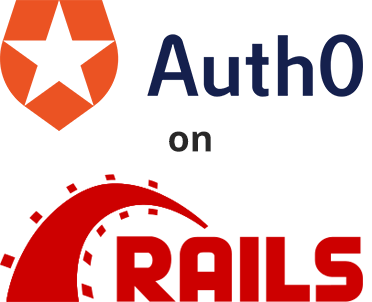
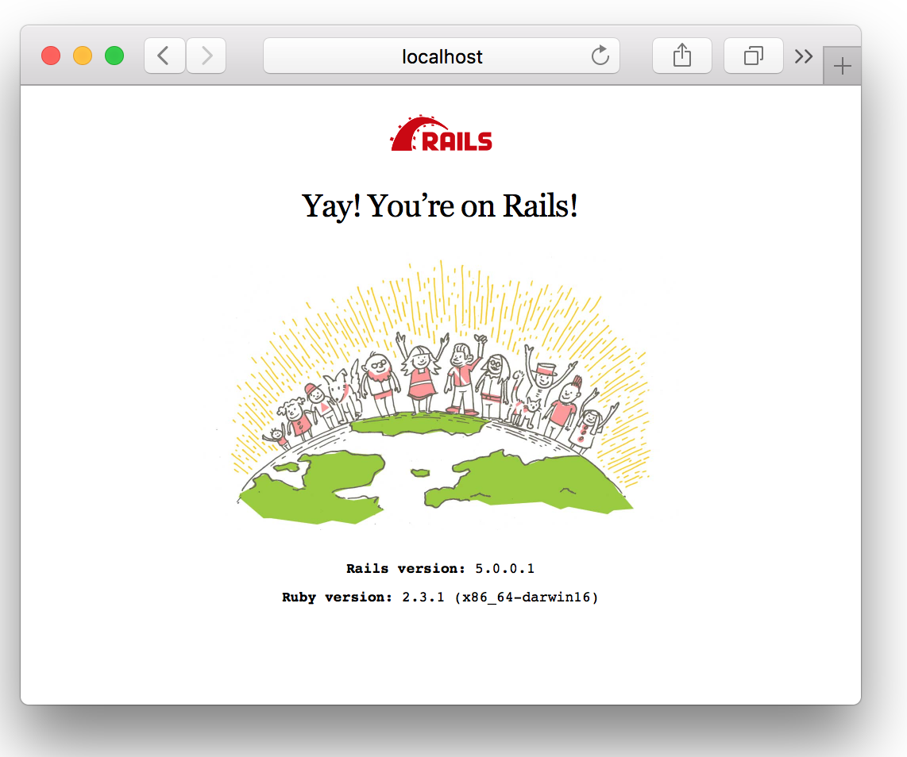
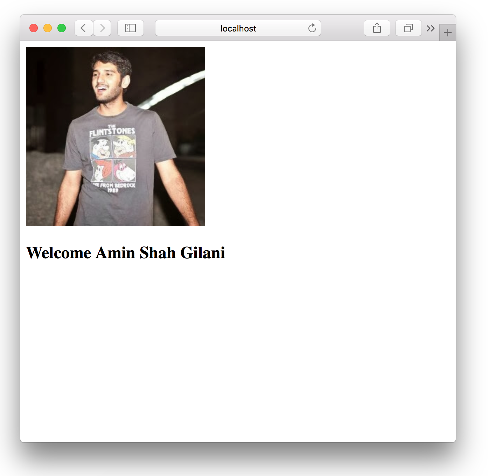

# Auth0 with Rails 5



Rails 5 is out with Action Cable, a brand new API mode, and best of all, Rake tasks inside Rails!

The existing quickstart at Auth0 aims to get you up and running really fast. But in this tutorial, we'll create a new application that compartmentalizes your code appropriately, does everything in The Rails Way. This will lead to a stronger base on which to grow your application.

As an added bonus, this application will be compatible with [Pundit](https://github.com/elabs/pundit) right out of the box!

## Setting up an Auth0 powered Rails App

There's already an Auth0 tutorial on making a Ruby on Rails app, but it skips over a few best practices to keep things simple. I'll walk you through a more powerful initial setup.

### Generating a Rails App



If you're working with rails, you already know this, but I like to keep things complete. We're also going to be using postgresql as our database, even in development. It's good practice to reflect your production environment as closely as possible in development, and databases can be particularly tricky since some migrations that work with, say, sqlite won't work with postgresql.

```bash
$ rails new auth0_setup --database=postgresql
```

### Setting up Gems

Omniauth is a flexible authentication system that standardizes authentication over several providers through custom strategies. Auth0 already has an Omniauth strategy designed for drop in use!

Adhering to best practices, we're going to be storing secrets in environment variables instead of checking them into our code. To make it easier to setup environment variables in development, we'll need the [dotenv](https://github.com/bkeepers/dotenv) gem.

Add the following to your `Gemfile` and run `bundle install`:

```ruby
# Standard Auth0 requirements
gem 'omniauth', '~> 1.3.1'
gem 'omniauth-auth0', '~> 1.4.1'
# Secrets should never be stored in code
gem 'dotenv-rails', require: 'dotenv/rails-now', group: [:development, :test]
```

### Setup your environment variables

Dotenv will load environment variables stored in the `.env` file, so you don't want to check that into version control. Add the following to your `.gitignore` and commit it immediately.

```bash
# Ignore the environment variables
.env
```

Now we can safely store our secrets. Create a `.env` file, and copy your Auth0 tokens from the settings page of your [Client](https://manage.auth0.com/#/clients)

```
AUTH0_CLIENT_ID= #INSERT YOUR SECRET HERE
AUTH0_CLIENT_SECRET= #INSERT YOUR SECRET HERE
AUTH0_DOMAIN= #INSERT YOUR SECRET HERE
```

### Setup app secrets

Instead of referring to the secrets directly in your code, fetch them once in the secrets file, where they should be, and refer them via this file throughout your code. Make the following changes to your `config/secrets.yml`

```yaml
# Add this to the top of the file
default: &default
  auth0_client_id: <%= ENV['AUTH0_CLIENT_ID'] %>
  auth0_client_secret: <%= ENV['AUTH0_CLIENT_SECRET'] %>
  auth0_domain: <%= ENV['AUTH0_DOMAIN'] %>

# Make the rest of your groups inherit from default
development:
  <<: *default
  ...

test:
  <<: *default
  ...

production:
  <<: *default
  ...

```

### Create an initializer

Initializers are loaded before the application is executed. Let's configure Omniauth's Auth0 strategy and add it to the middleware stack. Create `config/initializers/auth0.rb` to configure OmniAuth.

```ruby
# Configure the middleware
Rails.application.config.middleware.use OmniAuth::Builder do
  provider(
    :auth0,
    Rails.application.secrets.auth0_client_id,
    Rails.application.secrets.auth0_client_secret,
    Rails.application.secrets.auth0_domain,
    callback_path: '/auth/auth0/callback'
  )
end
```

### Creating Pages

After authenticating the user, Auth0 will redirect to your app and tell you the if the authentication was successful. We need two callback urls, one for Auth0's response after an authorization request and one for us to redirect to and handle failure. We'll talk more about the second one later. For now let's name them `callback`, and `failure` respectively. They don't need any html, css, or javascript associated with them.

We also want two pages for our simplistic app, a publicly accessible home page, and a privately accessible dashboard. These will be in their own controllers.

```bash
rails g controller PublicPages home && \
rails g controller Dashboard show && \
rails g controller auth0 callback failure --skip-template-engine --skip-assets
```

Troubleshoot:  
If you get errors running your app at this point, you should probably setup your database with `rails db:setup && rails db:migrate`

Now let's wire up the routes to our controllers and actions. Make the following changes to `config/routes.rb`:

```ruby
# home page
root 'public_pages#home'

# Dashboard
get 'dashboard' => 'dashboard#show'

# Auth0 routes for authentication
get '/auth/auth0/callback' => 'auth0#callback'
get '/auth/failure'        => 'auth0#failure'
```

### Setup the Auth0 Controller

Replace the file in `/app/controllers/auth0_controller.rb` with

```ruby
class Auth0Controller < ApplicationController
  # This stores all the user information that came from Auth0
  # and the IdP
  def callback
    session[:userinfo] = request.env['omniauth.auth']

    # Redirect to the URL you want after successful auth
    redirect_to '/dashboard'
  end

  # This handles authentication failures
  def failure
    @error_type = request.params['error_type']
    @error_msg = request.params['error_msg']
    # TODO show a failure page or redirect to an error page
  end
end
```

You may want to finish the TODO above with your own custom behavior.

Auth0 only allows callbacks to a whitelist of URLs for security purposes. We also want a callback for our development environment so specify these callback urls at [Application Settings](https://manage.auth0.com/#/applications):

```
https://example.com/auth/auth0/callback
http://localhost:3000/auth/auth0/callback
```

Replace `https://example.com` with the URL of your actual application.

### Creating a login page


Auth0 provides a beautiful embedded login form called [Lock](https://auth0.com/docs/libraries/lock). It's designed to work with Auth0 and looks absolutely gorgeous. Replace the contents of `app/views/public_pages/home.html.erb`

```html
<div id="root" style="width: 320px; margin: 40px auto; padding: 10px; border-style: dashed; border-width: 1px; box-sizing: border-box;">
    embedded area
</div>
<script src="https://cdn.auth0.com/js/lock/10.2/lock.min.js"></script>
<script>
  var lock = new Auth0Lock(
    '<%= Rails.application.secrets.auth0_client_id %>',
    '<%= Rails.application.secrets.auth0_domain %>', {
    container: 'root',
    auth: {
      redirectUrl: '',
      responseType: 'code',
      params: {
        scope: 'openid email' // Learn about scopes: https://auth0.com/docs/scopes
      }
    }
  });
  lock.show();
</script>
```

### An auth0 helper

Coming from using Devise for authentication in Rails, I liked the helpers it gave so let's recreate those as closely as possible. Add the following to `app/helpers/auth0_helper.rb`

```ruby
module Auth0Helper
  private

  # Is the user signed in?
  # @return [Boolean]
  def user_signed_in?
    session[:userinfo].present?
  end

  # Set the @current_user or redirect to public page
  def authenticate_user!
    # Redirect to page that has the login here
    if user_signed_in?
      @current_user = session[:userinfo]
    else
      redirect_to login_path
    end
  end

  # What's the current_user?
  # @return [Hash]
  def current_user
    @current_user
  end

  # @return the path to the login page
  def login_path
    root_path
  end
end
```

For this helper to be available throughout your application, add this line to your `app/controllers/application_controller.rb`. All other controllers inherit from Application Controller.

```ruby
include Auth0Helper
```

### Showing user info in the dashboard



We don't really have any content to show in our sample application at this point so let's make our dashboard show the User's picture and name upon login!

`app/controllers/dashboard_controller.rb`
```
class DashboardController < ApplicationController
  before_action :authenticate_user!

  def show
    @user = current_user
  end
end
```

`app/views/dashboard/show.html.erb`
```
<div>
  "/>
  <h2>Welcome <%= @user[:info][:name] %></h2>
</div>
```


### Descriptive Errors

Remember the `failure` callback? When authentication fails, you want to handle it gracefully. So on unsuccessful authentication, let's make Omniauth internally redirect there and pass along an error description. Add this to your `config/initializers/omniauth.rb`

```ruby
OmniAuth.config.on_failure = Proc.new { |env|
  message_key = env['omniauth.error.type']
  error_description = Rack::Utils.escape(env['omniauth.error'].error_message)
  new_path = "#{env['SCRIPT_NAME']}#{OmniAuth.config.path_prefix}/failure?error_type=#{message_key}&error_msg=#{error_description}"
  Rack::Response.new(['302 Moved'], 302, 'Location' => new_path).finish
}
```

### Overflowing Cookies in Development

Cookies have a 4kb limit, which is too small to store our user's information in. More details can be found [here](http://stackoverflow.com/questions/9473808/cookie-overflow-in-rails-application) but to make your app work in development:

1. Add this to `/config/initializers/session_store.rb`

   ```
   Rails.application.config.session_store :cache_store
   ```

2. Add this to the end of the config block in `/config/enviroments/development.rb` so that it overrides all other instances:

   ```
   # enforce this rule
   config.cache_store = :memory_store
   ```

## Conclusion

Congratulations, you now have an application that:

1. Does not store any user information in the database
2. Handles authentication statelessly
3. Stores configuration secrets in environment variables
4. Provides a devise-like `current_user`
5. Follows the Rails Way in everything.

If you use Pundit for authorization it will work out of the box with your setup since it hooks onto `current_user`
